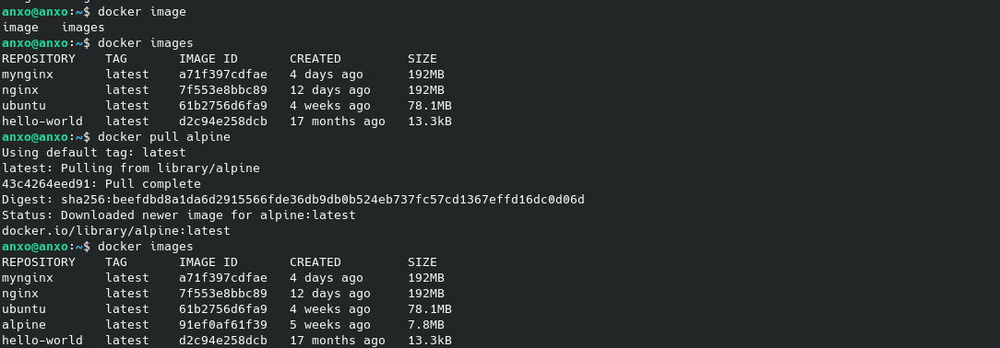
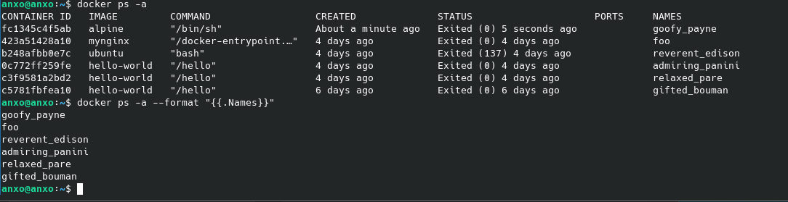
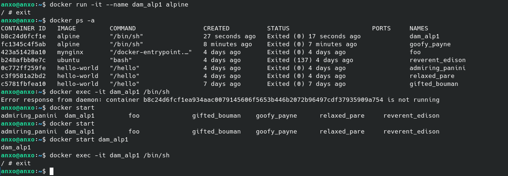
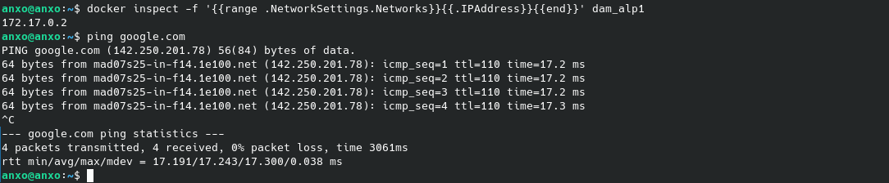
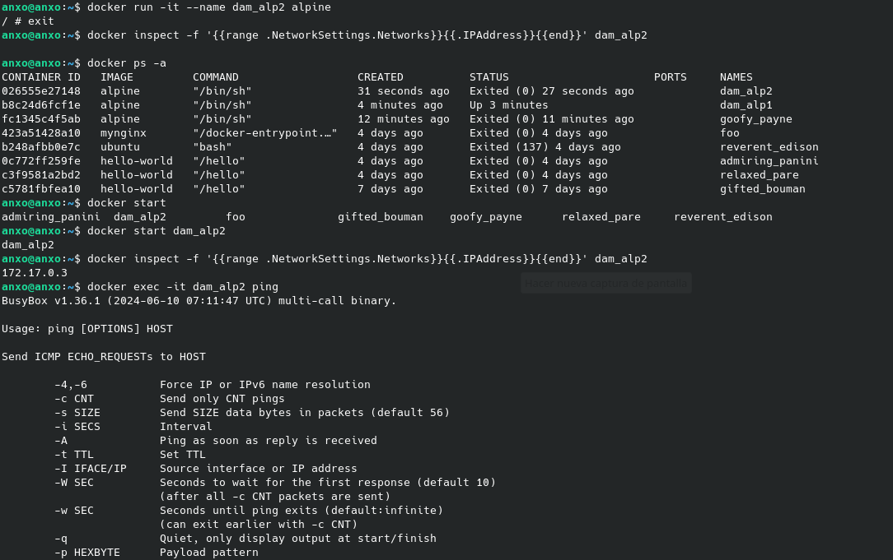
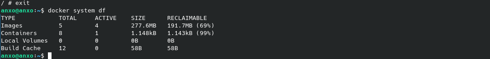

# Tarea 2 SXE
## Angel Jose Piñeiro Andion

### La siguiente práctica es una lista de tareas que tenéis que hacer. Por cada tarea tenéis que ir poniendo los comandos utilizados y, brevemente, describir el proceso.

### Crear un readme con mark down con las descripciones (un commit por cada apartado)

### Entregar el repositorio

### Utilizaremos la imagen de Alpine. Sigue las instrucciones:

### 1. Descarga la imagen "alpine" SIN ARRANCARLA y comprueba que está en tu equipo
En primer lugar descargamos la imagen de alpine con el siguiente comando.

    ```docker pull alpine```

Comprobamos que la imagen se ha descargado correctamente con el siguiente comando.

    ```docker images```

### 2. Crea un contenedor sin ponerle nombre. ¿está arrancado? Obtén el nombre
Creamos un contenedor sin nombre con el siguiente comando.

    ```docker run -it alpine```

Comprobamos que el contenedor se ha creado correctamente con el siguiente comando.

    ```docker ps -a```

Obtenemos el nombre del contenedor con el siguiente comando.

    ```docker ps -a --format "{{.Names}}"```

### 3. Crea un contenedor con el nombre 'dam_alp1'. ¿Como puedes acceder a él?
Creamos un contenedor con el nombre 'dam_alp1' con el siguiente comando.

    ```docker run -it --name dam_alp1 alpine```

Accedemos al contenedor con el siguiente comando.

    ```docker exec -it dam_alp1 /bin/sh```


### 4. Comprueba que ip tiene y si puedes hacer un ping a google.com
Comprobamos la ip del contenedor con el siguiente comando.

    ```docker inspect -f '{{range .NetworkSettings.Networks}}{{.IPAddress}}{{end}}' dam_alp1```

Hacemos ping a google.com con el siguiente comando.

    ```ping google.com```


### 5. Crea un contenedor con el nombre 'dam_alp2'. ¿Puedes hacer ping entre los contenedores?
Creamos un contenedor con el nombre 'dam_alp2' con el siguiente comando.

    ```docker run -it --name dam_alp2 alpine```

Comprobamos la ip del contenedor con el siguiente comando.

    ```docker inspect -f '{{range .NetworkSettings.Networks}}{{.IPAddress}}{{end}}' dam_alp2```

Hacemos ping al contenedor 'dam_alp1' con el siguiente comando.

    ```docker exec -it dam_alp2 ping


### 6. Sal del terminal, ¿que ocurrió con el contenedor?

Salimos del terminal con el comando 'exit'. El contenedor sigue en ejecución.

    ```docker ps -a```

### 7. ¿Cuanta memoria en el disco duro ocupaste?

Comprobamos la memoria ocupada en el disco duro con el siguiente comando.

    ```docker system df```

